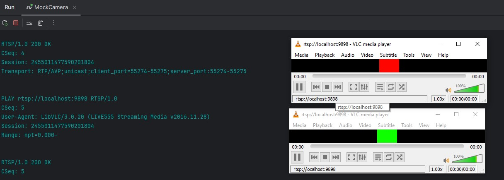

### A RTSP/RTP streaming server in C#
This app refers to the original server from topic ["A fully functional RTSP/RTP streaming server hello world example in C++ for experimentation with JPEG payloads."](https://www.medialan.de/usecase0001.html) 
and helps understand how RTSP and RTP protocols works.

In general this is a simple app which can produce multiple RTSP streams to any client.

Now it works on port `9898` and a client (for example VLC) can connect 
to the address `rtsp://localhost:9898` and then consume data from rtp-port `10897`.

